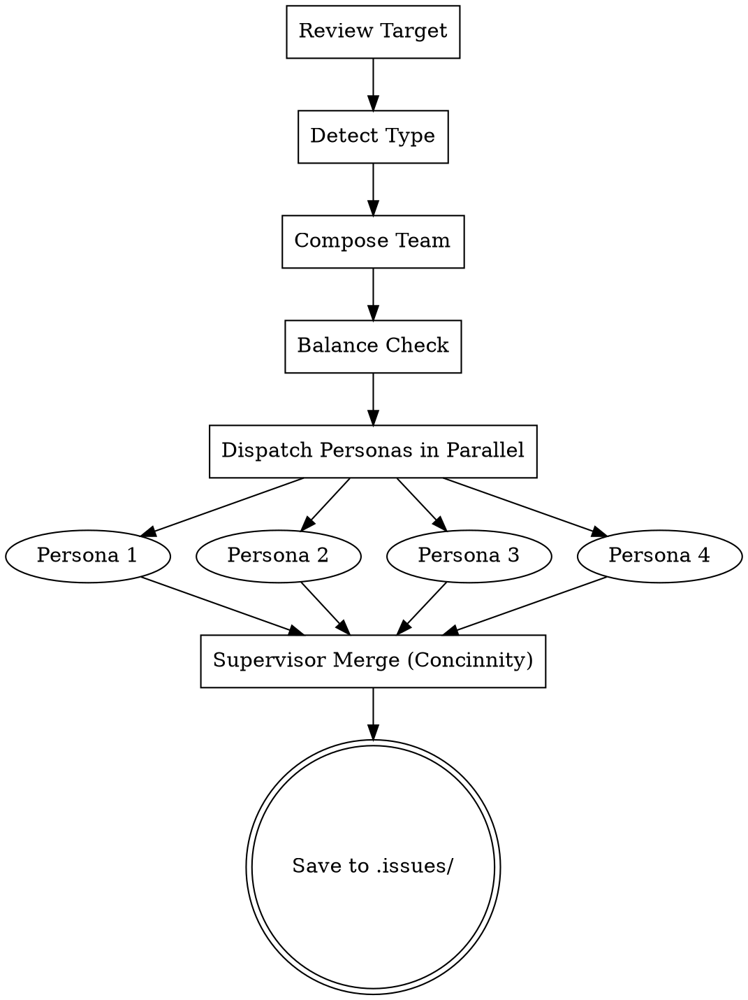

# Zodiac Team Review

## Overview

**Multi-agent review powered by zodiac developer personas.** Auto-detects what you're reviewing (code, spec, design, plan), selects the right team of zodiac personas, dispatches each as a parallel review agent with persona-derived lenses, merges findings using Concinnity, and saves to `.issues/`.

Each persona's review lens is derived from their traits — strengths define what they focus on, other team members' strengths define what they avoid. This prevents overlap while ensuring complete coverage.

## When to Use

Use when:
- Reviewing code changes, diffs, or pull requests
- Reviewing specs, designs, or implementation plans
- You want persona-driven review diversity instead of fixed lenses
- You want auto-detected review type and team selection

Don't use for:
- Your own code before writing it (use TDD instead)
- Quick "does this look right?" checks (overkill)
- Environments without Agent tool support

**Arguments:**
- `/zodiac-team-review` — auto-detect type, auto-select team
- `/zodiac-team-review --type code` — force review type (code, spec, design, plan)
- `/zodiac-team-review --team virgo,scorpio,aries` — override team selection

## Step 0: Detect Review Type

Before composing a team, determine what you're reviewing. Check for `--type` override first; otherwise detect from signals.

| Priority | Signal | Review Type |
|----------|--------|------------|
| 1 | `--type code\|spec\|design\|plan` flag | Use specified type |
| 2 | git diff output present, or reviewing a PR/changeset | **Code review** |
| 3 | Markdown with "Requirements", "Success Criteria", or "Scope" headings | **Spec review** |
| 4 | Markdown with "Architecture", "Components", or "Data Flow" headings | **Design review** |
| 5 | Markdown with "Tasks", "Steps", or "Implementation Plan" headings | **Plan review** |
| 6 | None of the above | **General review** |

**Detection happens once at the start.** The detected type drives team selection in Step 1.

## Step 1: Compose Team

### Default Teams by Review Type

| Review Type | Team | Elements | Modalities | Rationale |
|------------|------|----------|------------|-----------|
| **Code** | Virgo + Scorpio + Leo + Pisces | Earth, Water, Fire, Water | Mutable, Fixed, Fixed, Mutable | Analyst catches bugs, Debugger finds edge cases, Tech Lead holds quality bar, UX Empath checks user impact |
| **Spec** | Capricorn + Aquarius + Pisces + Virgo | Earth, Air, Water, Earth | Cardinal, Fixed, Mutable, Mutable | Program Architect checks structure, Systems Architect checks feasibility, UX Empath checks user needs, Analyst checks precision |
| **Design** | Aquarius + Libra + Scorpio + Cancer | Air, Air, Water, Water | Fixed, Cardinal, Fixed, Cardinal | Systems Architect checks vision, API Designer checks interfaces, Debugger stress-tests, Team Anchor checks accessibility |
| **Plan** | Capricorn + Aries + Taurus + Virgo | Earth, Fire, Earth, Earth | Cardinal, Cardinal, Fixed, Mutable | Program Architect checks structure, Launcher checks actionability, Reliability Engineer checks feasibility, Analyst checks detail |
| **General** | Virgo + Scorpio + Aquarius + Pisces | Earth, Water, Air, Water | Mutable, Fixed, Fixed, Mutable | Balanced coverage: correctness, depth, systems thinking, user perspective |

### User Override

If `--team` is specified (e.g., `--team virgo,scorpio,aries`), use those personas instead.

### Element/Modality Balance Check

After selecting the team (default or override), validate balance:

**Element coverage** (need at least 3 of 4):
- Fire (Aries, Leo, Sagittarius) — action, shipping
- Earth (Taurus, Virgo, Capricorn) — correctness, quality
- Air (Gemini, Libra, Aquarius) — systems thinking, patterns
- Water (Cancer, Scorpio, Pisces) — depth, user empathy

**Modality coverage** (prefer at least 2 of 3):
- Cardinal (Aries, Cancer, Libra, Capricorn) — initiators
- Fixed (Taurus, Leo, Scorpio, Aquarius) — sustainers
- Mutable (Gemini, Virgo, Sagittarius, Pisces) — adapters

If coverage is incomplete, note it in the output as a **Coverage note** (non-blocking warning).

## Persona Lens Reference

Each persona's review lens is derived from their zodiac skill file. **Allowed concerns** come from their strengths and ideal tasks. **Forbidden concerns** are the other team members' strengths.

You do NOT need to memorize this table — read each persona's skill file at dispatch time and derive their lens. This table is a reference for the orchestrator.

| Persona | Archetype | Allowed Concerns (Review Lens) | Forbidden Concerns (Other Personas' Territory) |
|---------|-----------|-------------------------------|-----------------------------------------------|
| **Aries** | The Launcher | Unnecessary complexity, over-engineering, scope creep, shipping blockers | Correctness details, edge cases, UX polish, architecture coherence |
| **Taurus** | The Reliability Engineer | Error handling, failure modes, operational concerns, rollback plans, migration safety | Style, naming, UX, spec compliance, architecture elegance |
| **Gemini** | The Polyglot | Cross-system consistency, API contract alignment, integration issues, mixed patterns | Deep correctness, single-system architecture, UX, edge cases |
| **Cancer** | The Team Anchor | Developer experience, code approachability, documentation gaps, maintainability for the next person | Correctness bugs, architecture, performance, spec compliance |
| **Leo** | The Tech Lead | Craftsmanship quality, API cleanliness, consistent patterns, code pride | Edge cases, UX user impact, spec compliance, operational concerns |
| **Virgo** | The Code Analyst | Correctness, contract violations, off-by-one errors, naming precision, test coverage gaps | Big-picture architecture, UX, shipping concerns, operational reality |
| **Libra** | The API Designer | Interface balance, API ergonomics, contract fairness, boundary clarity | Implementation correctness, edge cases, operational concerns, style |
| **Scorpio** | The Debugger | Hidden bugs, race conditions, state corruption, security vulnerabilities, root cause issues | Style, naming, architecture, UX, craftsmanship |
| **Sagittarius** | The Explorer | Better patterns or tools, missed approaches, emerging best practices, assumption challenges | Correctness details, operational concerns, naming, consistency |
| **Capricorn** | The Program Architect | Structural fit with long-term architecture, dependency management, sequencing, standards compliance | UX, edge cases, naming polish, operational reality |
| **Aquarius** | The Systems Architect | Architectural coherence, conceptual model fit, system-level patterns, radical alternatives | Correctness details, naming, operational concerns, user empathy |
| **Pisces** | The UX Empath | User impact, error message quality, workflow intuitiveness, accessibility, developer experience | Correctness bugs, architecture, spec compliance, naming precision |

**How to use this at dispatch time:**

For each persona on the team:
1. Dispatch via the Agent tool using agent name `zodiac-{sign}` (e.g., `zodiac-virgo`)
2. The agent definition provides the persona identity automatically
3. Pass in the prompt: ALLOWED concerns, FORBIDDEN concerns, review target, and output format
4. This ensures zero overlap between agents

## Step 2: Dispatch Persona Agents

**YOU MUST dispatch actual subagents using the Agent tool. Do NOT simulate the review in your head.**

Launch all team members concurrently using Agent tool in a SINGLE message.

### Content Injection

Inline the review target directly into each agent's prompt. If the target is too large to inline (e.g., a multi-file diff over 500 lines), provide file paths and instruct the subagent to read them using the Read tool.

### Agent Prompt Template

For each persona on the team, construct this prompt:

~~~
REVIEW MODE: {Review Type} Review
TARGET:
{diff content, file content, or spec content}

YOUR REVIEW LENS (derived from your persona):

ALLOWED CONCERNS — focus ONLY on these:
{Allowed concerns from Persona Lens Reference table}

FORBIDDEN CONCERNS — do NOT comment on these (other team members own these):
{For each other team member: "- {Their allowed concerns} ({Their sign})"}

RULES:
- Return UP TO 5 issues (fewer is fine if you find fewer)
- Each issue must fall within your ALLOWED CONCERNS
- Do NOT comment on anything in FORBIDDEN CONCERNS
- Classify each issue using Concinnity: P1 Correct (bugs, violations), P2 Cognition (confusing), P3 Conformant (inconsistent), P4 Compatible (non-idiomatic)
- Use this exact format for each issue:

### Issue: {Brief title}
- **Priority:** {P1 Correct | P2 Cognition | P3 Conformant | P4 Compatible}
- **File:** {path:line} (or "Spec section: {heading}" for non-code reviews)
- **Code/Quote:** {relevant snippet}
- **Problem:** {what's wrong and why it matters}
- **Suggestion:** {how to fix it}

{If ANY domain rule's "Applies when" matches the review target, append to ALL personas:}

DOMAIN RULES (evaluate through your own lens, in addition to your core concerns):
{domain_rules_context}
~~~

### Dispatch Example (Code Review with Virgo, Scorpio, Leo, Pisces)

```markdown
I'll review this using the zodiac team review system.

**Team:** Virgo (Code Analyst) + Scorpio (Debugger) + Leo (Tech Lead) + Pisces (UX Empath)

[Single message containing 4 Agent tool calls — one per persona, ALL in parallel]
```

**CRITICAL:**
- All team members MUST be actual Agent tool invocations (separate subagents)
- All MUST be dispatched in a SINGLE message (parallel, not sequential)
- Do NOT simulate multiple perspectives yourself
- Do NOT dispatch sequentially — one message, multiple Agent calls

## Step 3: Supervisor Merge (Concinnity Prioritization)

Collect results from all persona agents and apply the **Concinnity framework** to prioritize.

### 3a. Deduplicate

If two personas found the same issue from different angles, keep the stronger framing and credit the persona who articulated it best.

### 3b. Prioritize Using Concinnity

Rank every issue by which principle it violates, NOT by which persona found it:

| Priority | Principle | Review Examples |
|----------|-----------|-----------------|
| **P1** | **Correct** | Bugs, contract violations, race conditions, missing requirements, security vulnerabilities |
| **P2** | **Cognition** | Confusing logic, ambiguous terms, poor naming, unreadable code, unclear error messages |
| **P3** | **Conformant** | Inconsistent patterns, deviates from project conventions, doesn't match codebase style |
| **P4** | **Compatible** | Non-idiomatic for language/framework, ignores ecosystem standards, unfamiliar patterns |

### 3c. Bucket into Three Groups

- **Blocking Issues** — P1 (Correct). Must fix before merge/approval.
- **Should Fix** — P2 (Cognition). Hard to understand = hard to maintain.
- **Consider** — P3/P4 (Conformant/Compatible). Consistency and standards.

## Step 4: Save Review

Save the distilled review to a file. The file format is self-contained — `dot-issues` is an optional consumer that adds triage/auto-fix workflows on top.

### File Location

`.issues/{YYYY-MM-DD}__zodiac-review-{subject}.md`

Create `.issues/` folder if it doesn't exist.

### Output Template

````markdown
# Zodiac Team Review: {subject}

**Reviewed:** {YYYY-MM-DD}
**Reviewer:** Claude (zodiac-team-review)
**Review type:** {Code|Spec|Design|Plan|General} review ({auto-detected|user-specified})

---

## Team Composition

- **Team:** {Sign1} ({Archetype1}), {Sign2} ({Archetype2}), ...
- **Element coverage:** {element1}, {element2}, ... ({missing elements if any})
- **Modality coverage:** {modality1}, {modality2}, ... ({missing modalities if any})
{If coverage gaps:}
- **Coverage note:** {What perspective may be underrepresented due to missing element/modality}

---

## Blocking Issues (P1 — Correct)

### [ ] Issue 1: {Category} - {Brief description}

- **Found by:** {Sign} ({Archetype})
- **File:** [{path}:{lines}]({path})
- **Code:**
```{lang}
{relevant snippet}
```
- **Problem:** {explanation}
- **Suggestion:** {how to fix}

---

## Should Fix (P2 — Cognition)

### [ ] Issue N: {Category} - {Brief description}

{same format}

---

## Consider (P3-P4 — Conformant/Compatible)

### [ ] Issue N: {Category} - {Brief description}

{same format}

---

## Summary

**Issues found:** {count}
**By priority:**
- Blocking Issues: {count}
- Should Fix: {count}
- Consider: {count}

### Next Steps

1. Review issues above and mark `[/]` to accept or `[-]` to reject
2. For accepted issues, apply the suggested fixes
````

After saving, present a closing message to the user. Check whether the `dot-issues` plugin is installed in the current session (look for skills in the `dot-issues:*` namespace in your available skills list):

- **If `dot-issues:dot-issues-show` is available:** Tell user: "Review saved to `.issues/{filename}`. Run `/dot-issues-show` to track progress, `/dot-issues-triage` to interactively accept/reject, or `/dot-issues-fix` to apply accepted fixes."
- **If `dot-issues` is NOT installed:** Tell user: "Review saved to `.issues/{filename}`. To triage and auto-fix these findings, install the companion plugin: `/plugin install dot-issues@concinnity`."

**Do NOT include in output:**
- Raw agent outputs (only the merged, deduplicated result)
- Commentary on the review process itself
- Explanations of which agent ran first or how dispatch worked

## Domain Rules

Domain rules are conditional context injected into **ALL team members' prompts** when the review target matches certain patterns. Each persona evaluates the domain rule through their own lens — no targeting by concern area needed.

**Before dispatching, check each domain rule's "Applies when" criteria against the review target. If matched, append the rule's context to EVERY persona's prompt as a `DOMAIN RULES:` section.**

### Domain Rule: Android PII Logging

**Applies when:** Code uses `Log.{v,d,i,w,e}(` or `Log.{v,d,i,w,e}PiiFree(`

**Inject into:** ALL team members

**Context:**

This codebase uses a custom Log class with two variant families:
- `Log.d(tag, msg)` — debug log, Android logcat only, debug builds only
- `Log.dPiiFree(tag, msg)` — PII-safe log, goes to BOTH logcat AND LogManager (customer feedback)

All levels (v, d, i, w, e) have PiiFree counterparts. PiiFree also supports structured logging: `dPiiFree(tag, msg, extraTags, properties)`.

**CRITICAL: PiiFree logs may be collected and sent to Microsoft support. They MUST NOT contain PII.**

PII includes: file paths, URLs, file names, user IDs, emails, tokens, credentials, unsanitized exception messages.

Safe for PiiFree: operation outcomes, error codes, HTTP status codes, metrics, config values, technical details.

**What to flag:**
1. **(P1 Blocking)** PiiFree call that logs PII
2. **(P1 Blocking)** PiiFree call logging unsanitized exception.message
3. **(P2 Should Fix)** Using Log.d() where Log.dPiiFree() would be appropriate
4. **(Consider)** Opportunity to add structured logging (extraTags/properties)

**Example violations:**
```kotlin
// BLOCKING: PII in PiiFree call
Log.dPiiFree(TAG, "Opening file: $filePath")
Log.iPiiFree(TAG, "User signed in: $userEmail")
Log.ePiiFree(TAG, "Error: ${exception.message}")

// SAFE PiiFree usage
Log.dPiiFree(TAG, "Sync completed", arrayOf(UPLOAD, COMPLETED),
    mapOf(PROP_DURATION_MS to "$duration"))
```

### Domain Rule: Android MockRampValues for Test Isolation

**Applies when:** Test code uses `mockkObject(RampSettings` or `mockkStatic(RampSettings`

**Inject into:** ALL team members

**Context:**

This codebase has two ways to mock feature flags:
- `MockRampValues` (correct) — lightweight `RampConnection` implementation, `AutoCloseable`
- `mockkObject(RampSettings.XXX)` (incorrect) — MockK static mocking of legacy class

**CRITICAL: Tests MUST use `MockRampValues` instead of `mockkObject`/`mockkStatic` on `RampSettings`.**

**Why MockRampValues is required:**
- **Thread safety** — RampSetting uses atomic version-based staleness; mockkObject bypasses this
- **Test isolation** — MockRampValues creates per-test instances; mockkObject mutates global static state
- **Automatic cleanup** — `AutoCloseable` with `use {}` block ensures cleanup even on test failure

**What to flag:**
1. **(P2 Should Fix)** `mockkObject(RampSettings.XXX)` — use `MockRampValues.of(setting, value).use { }` instead
2. **(P2 Should Fix)** `mockkStatic(RampSettings::class)` — same fix
3. **(P2 Should Fix)** MockRampValues created but not closed (missing `.use {}` or `.close()`)

**Example violations:**
```kotlin
// SHOULD FIX: Static mocking bypasses RampConnection contract
mockkObject(RampSettings.SHAKE_TO_SEND_FEEDBACK)
every { RampSettings.SHAKE_TO_SEND_FEEDBACK.isEnabled(ctx) } returns true

// CORRECT: Uses proper RampConnection injection
MockRampValues.of(ShakeToSendFeedback, true).use {
    // test code
}
```

## Common Mistakes

| Mistake | Fix |
|---------|-----|
| Dispatching personas sequentially | Dispatch ALL in a SINGLE message with parallel Agent calls |
| Including raw agent outputs in final review | Only show the merged, deduplicated, prioritized result |
| Letting personas comment outside their lens | Enforce FORBIDDEN CONCERNS in each prompt |
| Simulating personas yourself instead of dispatching | Use actual Agent tool subagents — single agent = single perspective |
| Skipping the supervisor merge | Always deduplicate and prioritize with Concinnity |
| Hardcoding domain rules into persona prompts | Keep domain rules separate; inject conditionally based on code patterns |
| Ignoring element/modality balance warnings | Note coverage gaps in output so the user is aware |
| Using 5 agents for every review | Team size varies by review type (typically 4 personas) |

## Rationalizations to Ignore

| Excuse | Reality |
|--------|---------|
| "I can keep persona perspectives separate in my head" | Baseline tests prove you can't. Dispatch real subagents. |
| "Too much overhead for a small diff" | Small diff = fast review. Same process. |
| "I'll just simulate the zodiac perspectives" | No. Each persona is a separate subagent. That's the point. |
| "The personas will find the same things anyway" | Forbidden concerns prevent overlap by design. |
| "I don't need the team composition header" | The header makes coverage gaps visible. Always include it. |

## Core Pattern Summary


